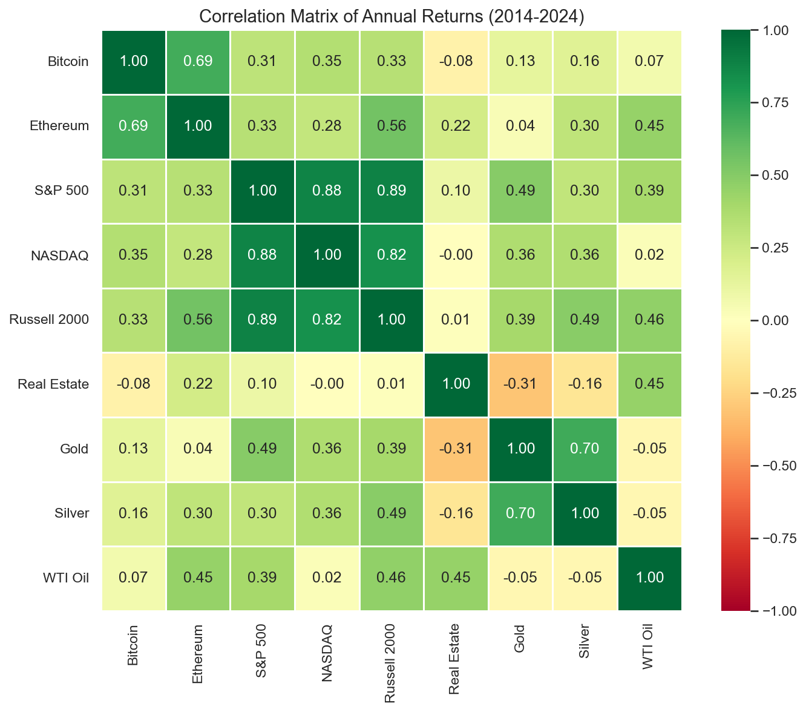
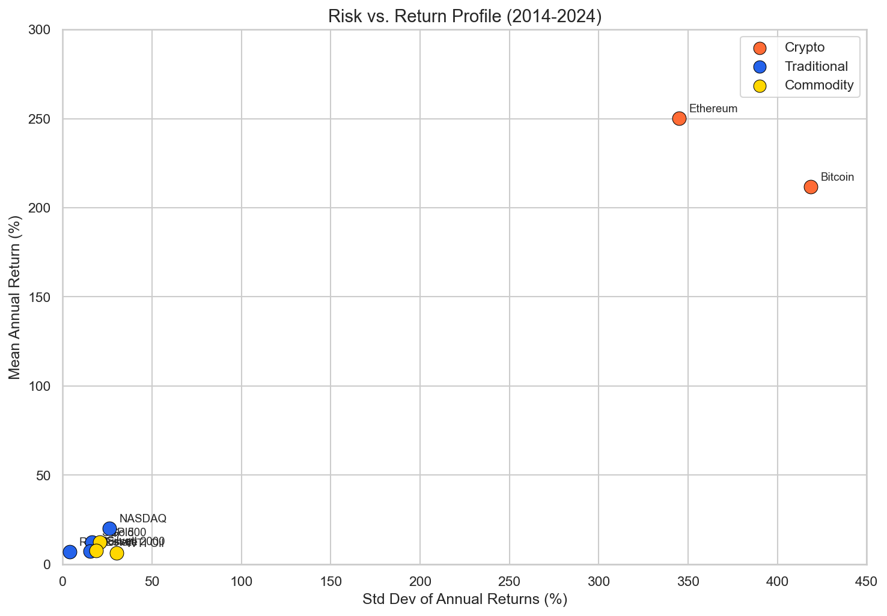
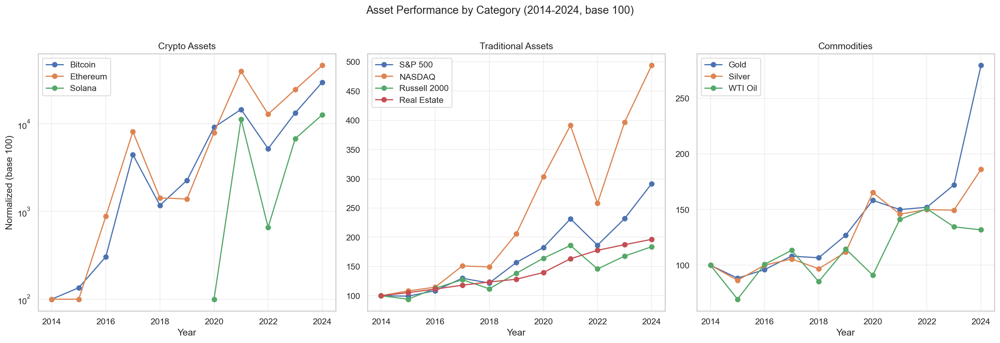

# Milestone 2: Investment Comparator

**COM-480 Data Visualization, EPFL 2025**

**Team:** Nicholas Brandstätter (330394), Marko Djuric (330515), Toufan Kashaev (347341)

**[Live Website](https://burek.vercel.app)**

---

## 1. Project Goal

Our project is an **interactive investment comparison tool** that enables users to explore and contrast the historical performance of assets across three major categories: cryptocurrencies (Bitcoin, Ethereum, Solana, Cardano, Polygon, Chainlink, Avalanche), traditional markets (S&P 500, NASDAQ, Russell 2000, FTSE 100, Nikkei 225, DAX, QQQ ETF, VTI ETF, US Real Estate), and commodities (Gold, Silver, WTI Oil, Copper, Natural Gas).

Built on 11 years of real historical data (2014–2024), the tool lets users select any combination of 20 assets, adjust time horizons (1, 5, or 10 years), and set a custom initial investment to see exactly how their portfolio would have performed.

**Core motivation:** Democratize financial analysis. Tools like Portfolio Visualizer or Bloomberg Terminal are either expensive or intimidating for non-professionals. Our target audience — university students, beginner investors, and finance enthusiasts — deserves an accessible, visually engaging alternative that turns raw data into intuitive insights.

**Educational value:** Through interactive time-series charts, side-by-side result cards with risk badges, a Dollar-Cost Averaging (DCA) simulator, and a risk analysis dashboard, users can answer: *"Is crypto worth the risk compared to gold, stocks, and real estate?"*

Beyond simple price comparison, the tool provides volatility indicators to contextualize risk, DCA simulations to demonstrate disciplined investing strategies, and risk metrics (Sharpe Ratio, Maximum Drawdown) offering professional-grade insight in an approachable format. The final version will expand to 15+ risk indicators, correlation matrices, and portfolio-building features.

---

## 2. Visualization Sketches

The prototype includes four main interfaces. Schematic wireframes are shown below; the fully functional implementation is live at [burek.vercel.app](https://burek.vercel.app).

### Main Comparator — Asset Selection
*Category-organized grid with investment amount, period, and filter controls. Users select from 20 assets across Crypto, Traditional Markets, and Commodities categories, with dynamic performance badges showing period-specific returns.*

### Performance Visualization & Results
*Multi-line normalized chart (base 100) with per-asset result cards showing Final Value, Return %, and risk badges (High/Medium/Low). Enables direct visual comparison of selected assets over the chosen time period.*

### DCA Calculator
*Monthly investment simulation comparing total invested vs. portfolio value over time. Users configure monthly contribution amount, select an asset, and choose a time horizon to see how dollar-cost averaging would have performed.*

### Risk Analysis Dashboard
*Volatility, Sharpe Ratio, and Max Drawdown comparison across selected assets. Risk metrics displayed in card format with visual indicators for easy cross-asset comparison.*

> **Live Interface:** All visualizations are fully functional at [burek.vercel.app](https://burek.vercel.app). Schematic wireframes are available in [milestone2.pdf](milestone2.pdf).

---

## 3. Tools & Lecture Connections

| Visualization | Tool / Library | Related Lecture(s) |
|---|---|---|
| Interactive asset selection & filtering | React 19 + TypeScript | **Lecture 5: Interactions** (filtering, brushing, linked views, Shneiderman's mantra) |
| Multi-line time series charts | Recharts (LineChart) | **Lecture 4: D3.js** (d3.line() path generator) + **Lecture 7: Do and dont in viz** (line chart best practices) |
| Performance comparison cards | Next.js 16 + Tailwind CSS | **Lecture 7: Designing viz** (task abstraction, design process) + **Lecture 11: Tabular data** (LineUp rankings) |
| Risk metrics dashboard | Custom TypeScript calculations | **Lecture 6: Mark, channels** (effectiveness rankings, visual encoding) + **Lecture 4: Data** (Stevens' scales) |
| DCA investment simulation | JavaScript + Recharts | **Lecture 12: Storytelling** (Freytag's pyramid, martini glass structure, progressive reveal) |
| Color-coded categories & risk badges | Tailwind CSS v4 | **Lecture 6: Perception colors** (categorical/sequential scales, ColorBrewer, preattentive processing) |

**Data sources:** CoinMarketCap, Yahoo Finance, EIA, Macrotrends, Kitco, FRED (Case-Shiller)

**Deployment:** Vercel | **EDA:** Python, pandas, matplotlib, seaborn

---

## 4. Implementation Breakdown

### Core Visualization (MVP) — DONE

The minimal viable product is fully functional and deployed at [burek.vercel.app](https://burek.vercel.app):

- Interactive 20-asset selection organized by category (Crypto, Traditional, Commodities)
- Time period controls (1y / 5y / 10y)
- Customizable investment amount input
- Multi-line normalized performance chart (base 100)
- Side-by-side comparison cards with key metrics (Final Value, Profit, Return %, Volatility)
- Category performance analysis grid
- Detailed comparison table with category tags
- DCA calculator with 6 major assets and performance chart
- Basic risk analysis (Volatility, Sharpe Ratio, Maximum Drawdown)
- Responsive design (desktop & mobile)

### Teaser UI & Previews — IN PROGRESS

Features visible in the UI but not fully implemented (planned for final):

- Portfolio Builder interface with "Coming Soon" badge
- Static correlation matrix preview from EDA analysis
- Historical Events toggle (disabled, labeled "Soon")
- DCA dropdown showing all 21 assets (6 functional, 15 with warning)
- Advanced Metrics preview modal listing 15+ professional indicators
- PDF export button with "Beta" badge

### Advanced Risk Metrics — PLANNED

Professional-grade analytics reserved for final presentation:

- 15+ professional indicators: Sortino Ratio, Value at Risk (VaR), Calmar Ratio, Beta, Alpha, Treynor Ratio, Information Ratio, Downside Deviation
- Interactive risk-return scatter plot with asset clustering
- Dynamic correlation heatmap with interactive filtering
- Historical event annotations on charts (2017 ICO boom, 2020 COVID crash, 2021 bull run, 2022 bear market)

### Portfolio & Analytics — PLANNED

Enhanced features that can be dropped without losing core value:

- Markowitz portfolio optimizer with efficient frontier visualization
- Diversification insights and rebalancing suggestions
- Expand DCA to full 21-asset analysis with monthly breakdowns
- Complete PDF export of analysis results
- Tooltip explanations for all financial terms
- Guided tour for beginner users

---

## 5. Exploratory Data Analysis

Full analysis available in [../milestone1/eda.ipynb](../milestone1/eda.ipynb).

**Key findings:**
- Crypto assets are extreme outliers in both return and volatility
- Stock indices cluster tightly (correlation r = 0.82–0.89)
- Gold/Silver form a distinct hedging group (r = 0.70)
- Real Estate shows lowest volatility (std 3.8%) with steady positive returns

### Correlation Matrix (2014–2024)

*Cross-asset return correlations reveal three distinct clusters*

### Risk vs. Return Profile

*Crypto: extreme risk-return outliers vs. traditional assets*

### Asset Performance by Category

*Normalized growth (base 100) across crypto, stocks, commodities*

---

## 6. Quick Start

**[Launch Application](https://burek.vercel.app)**

Try it now:
1. Select 2–3 assets (e.g., Bitcoin, S&P 500, Gold)
2. Choose a time period (1y / 5y / 10y)
3. Set an initial investment amount
4. Explore the interactive charts and comparisons

Or run locally:
```bash
npm install
npm run dev
# Open http://localhost:3000
```

---

## 7. Tech Stack

| Component | Technology |
|---|---|
| Framework | Next.js 16 (App Router) |
| UI Library | React 19 |
| Language | TypeScript |
| Visualization | Recharts |
| Styling | Tailwind CSS v4 |
| Deployment | Vercel |

---

## Repository Structure

```
burek/
├── milestones/
│   ├── milestone1/
│   │   └── eda.ipynb
│   └── milestone2/
│       ├── milestone2.md          ← this file
│       ├── milestone2.pdf
│       ├── milestone2.html
│       └── img/                   ← EDA visualizations
├── src/app/                       ← Next.js application
│   ├── page.tsx                   ← Main comparator
│   ├── dca-calculator/page.tsx    ← DCA simulator
│   └── risk-analysis/page.tsx     ← Risk dashboard
└── public/                        ← Static assets
```

---

**Status:** MVP functional, advanced features in development for final presentation.
